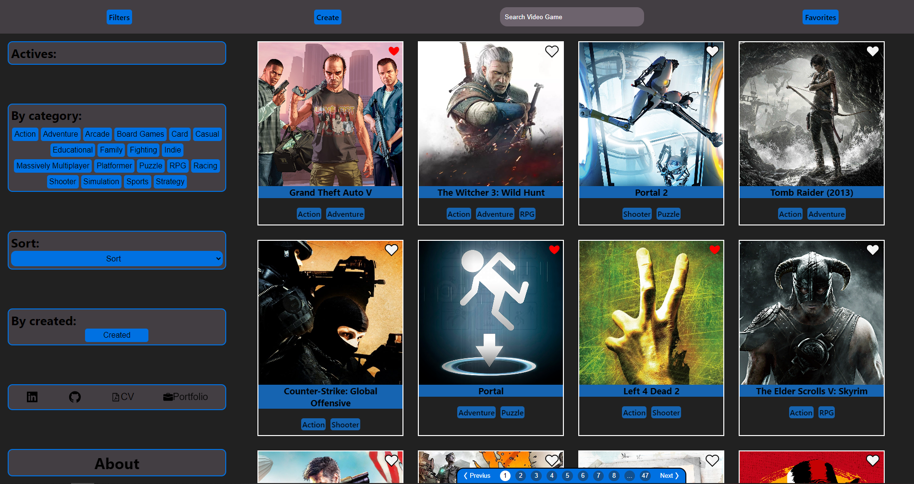
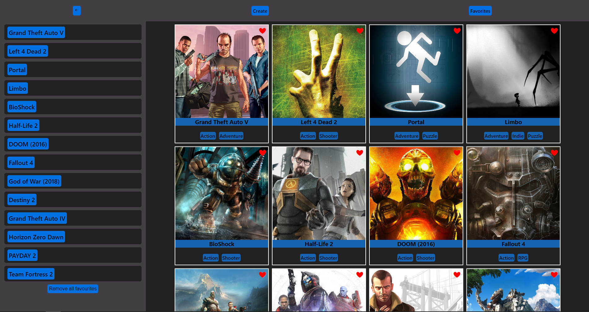
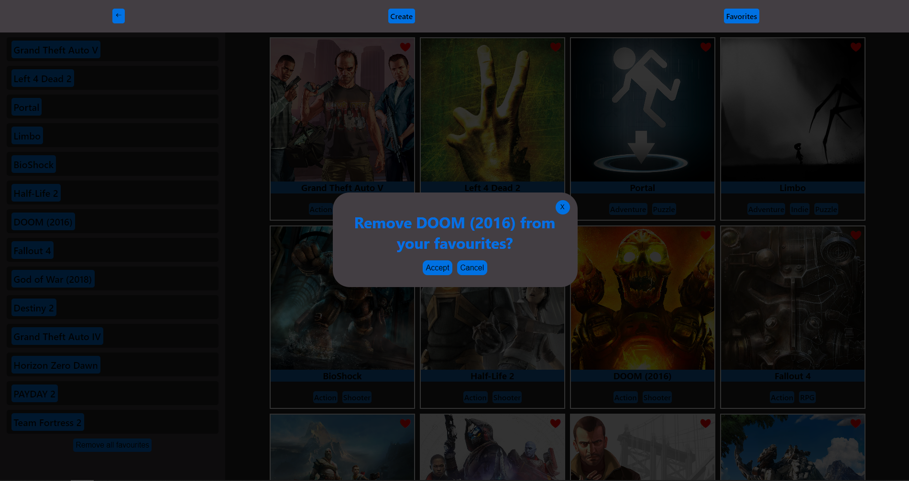
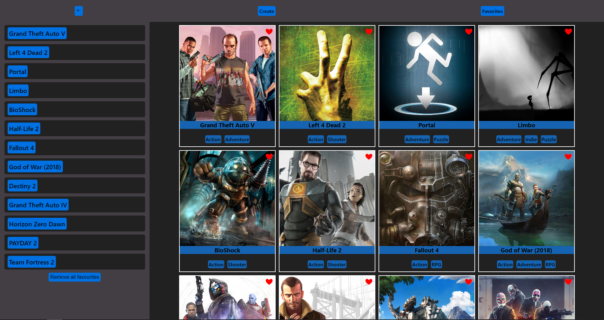
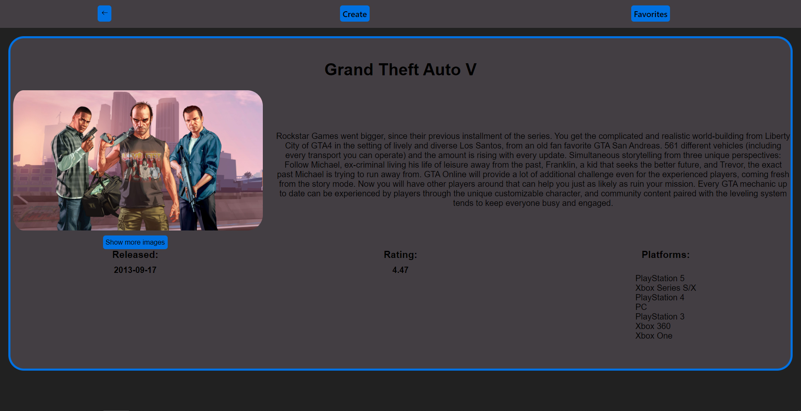
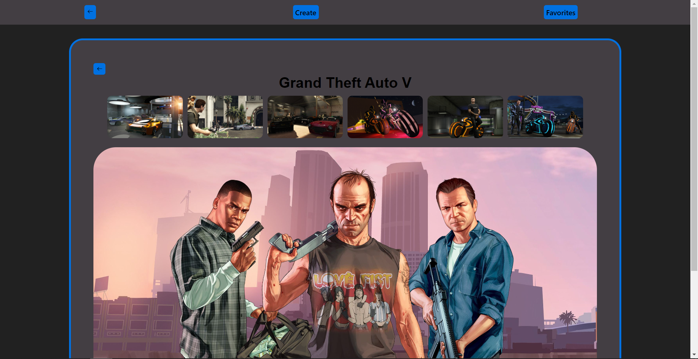
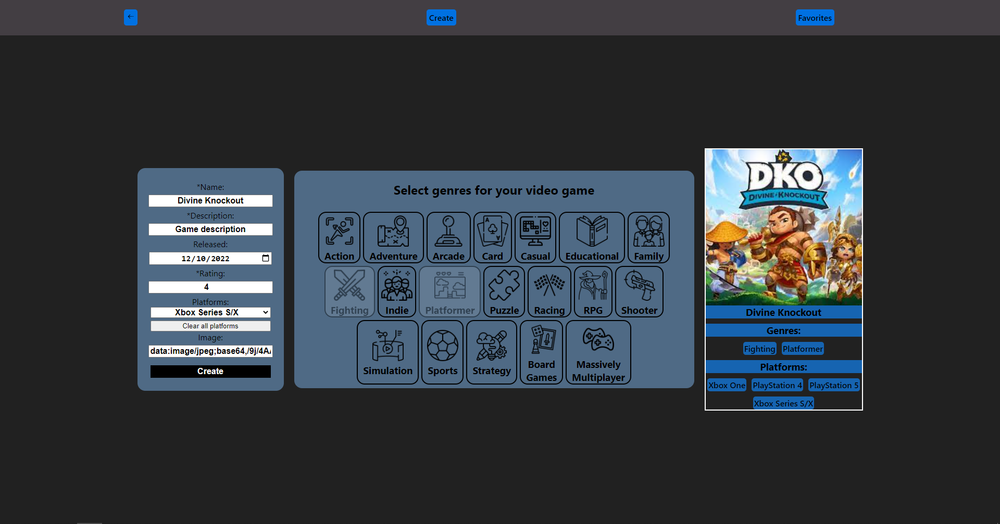
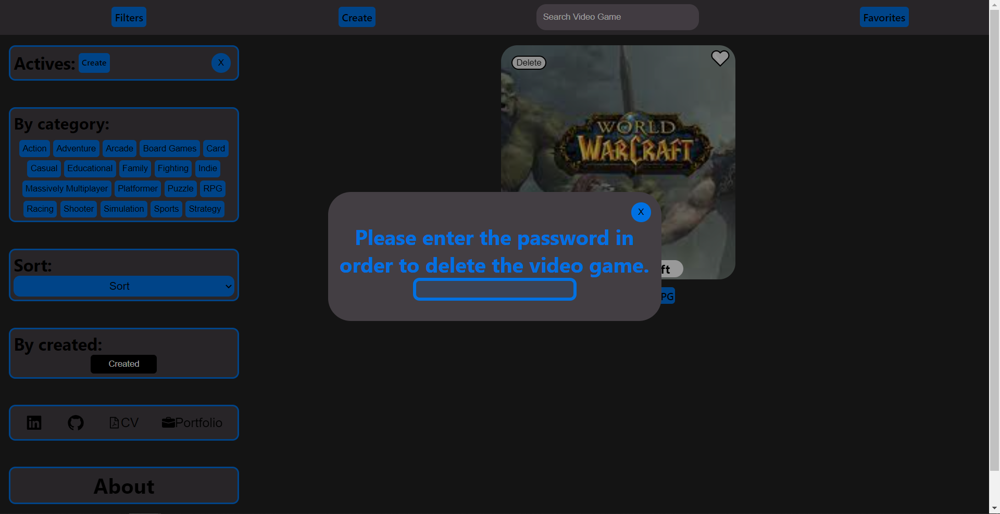

### 
<a href='https://game-informer.vercel.app/'> 💡 Game Informer </a> 

<pre>🎮Game Informer es una SPA en la que podrás ver TODOS los juegos que quieras con: 🔸Información específica de cada video juego(imágenes, fecha de lanzamiento, plataformas, etc.)
🔸En su home se encuentra un apartado de búsqueda, filtros y ordenamientos combinados.
🔸Podrás crear nuevos juegos mediante un formulario totalmente controlado y persistente.
🔸Eliminar el video juego creado.
🔸Navegar por toda la página mediante la navbar y/o paginación.
🔸Guardar sus juegos favoritos.
🔸Apartado about donde se especifica la página al detalle.
</pre>

  
  
  
  
  
  
  
  
  

### 
 🛠 Tecnologías y herramientas usadas: 

  

   
   
  
  
  
    
    
  
  
  
  
  
  
 

       🔹JavaScript
       🔹React.js
       🔹Node.js
       🔹Redux 
       🔹Express 
       🔹CSS
       🔹HTML
       🔹PostgreSQL
       🔹Sequelize
  
 
 

  

 

## Contacto

 <a href='https://www.linkedin.com/in/fermin-solaberrieta/'>  LinkedIn </a> 

 📫 fermin234@hotmail.com 

 📱  +54 2473-400240 

